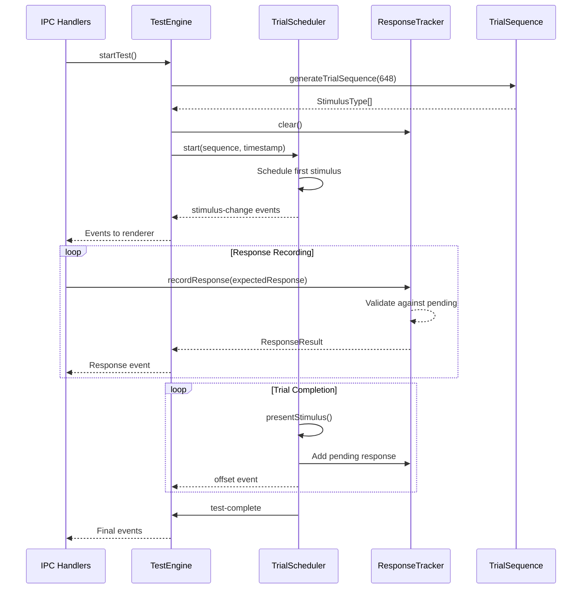

# Test Engine Refactoring Plan

This document details the implementation plan for refactoring `src/main/test-engine.ts` into modular components.

## Current State Analysis

**File:** `src/main/test-engine.ts` (431 lines)
**Responsibilities Mixed:**
1. Test State Management (module-level variables)
2. Trial Sequence Generation
3. Timing/Scheduling Engine
4. Response Recording
5. Window/Event Emission

---

## Phase 1: Extract TrialScheduler Class

**Priority:** HIGH - Contains most complex timing logic
**New File:** `src/main/trial-scheduler.ts`

### Extracted Responsibilities
- Trial timing orchestration with drift correction
- Stimulus presentation scheduling
- Trial state transitions (buffer → stimulus → inter-trial)
- Absolute timestamp-based scheduling

### Class Structure

```typescript
export class TrialScheduler {
  // Constructor
  constructor(
    private config: TestConfig,
    private onStimulusChange: (event: TestEvent) => void,
    private onTestComplete: (data: TestCompleteData) => void
  );

  // Public API
  start(sequence: StimulusType[], startTimeNs: bigint): void;
  stop(): void;
  getCurrentTrialIndex(): number;
  isRunning(): boolean;

  // Private methods
  private scheduleNextTrial(): void;
  private presentStimulus(): void;
  private complete(): void;
}
```

### Files to Modify
- `src/main/test-engine.ts` - Remove timing logic, delegate to TrialScheduler
- `src/main/ipc-handlers.ts` - Update IPC handler dependencies

### Implementation Steps

| Step | Action |
|------|--------|
| 1.1 | Create `src/main/trial-scheduler.ts` with TrialScheduler class |
| 1.2 | Move `runStimulusSequence()` and `presentStimulus()` logic into class |
| 1.3 | Move `completeTest()` logic into class |
| 1.4 | Refactor `startTest()` to instantiate and delegate to TrialScheduler |
| 1.5 | Update `stopTest()` to delegate to TrialScheduler |
| 1.6 | Remove extracted functions from test-engine.ts |

### Key Considerations
- Maintain existing drift correction algorithm
- Keep setTimeout-based scheduling (cannot use setInterval for drift correction)
- Ensure `testRunning` state is encapsulated within class

---

## Phase 2: Extract TrialSequenceGenerator Module

**Priority:** MEDIUM - Stateless utility
**New File:** `src/main/trial-sequence.ts`

### Extracted Responsibilities
- Fisher-Yates shuffle algorithm
- Two-half ratio trial sequence generation

### Module Structure

```typescript
export interface TrialSequenceGenerator {
  generate(totalTrials: number): StimulusType[];
}

export const trialSequenceGenerator: TrialSequenceGenerator = {
  generate(totalTrials: number): StimulusType[] {
    // Implementation from test-engine.ts lines 90-118
  }
};

export function shuffleArray<T>(array: T[]): void {
  // Implementation from test-engine.ts lines 75-80
}
```

### Files to Modify
- `src/main/test-engine.ts` - Import from trial-sequence.ts
- New `src/main/trial-sequence.ts`

### Implementation Steps

| Step | Action |
|------|--------|
| 2.1 | Create `src/main/trial-sequence.ts` with generator functions |
| 2.2 | Move `shuffleArray()` utility |
| 2.3 | Move `generateTrialSequence()` function |
| 2.4 | Update `test-engine.ts` to import from trial-sequence.ts |

### Key Considerations
- This module is stateless and easily testable
- No timing dependencies
- Can add unit tests for shuffle randomness

---

## Phase 3: Extract ResponseTracker Class

**Priority:** MEDIUM - Response validation logic
**New File:** `src/main/response-tracker.ts`

### Extracted Responsibilities
- Pending response window management
- Response validation against stimulus onset
- Anticipatory response detection
- Commission/omission error detection
- Response count tracking

### Class Structure

```typescript
export interface ResponseResult {
  trialIndex: number;
  stimulusType: StimulusType;
  responseCorrect: boolean;
  responseTimeMs: number;
  responseCount: number;
  isAnticipatory: boolean;
  isCommissionError: boolean;
}

export class ResponseTracker {
  constructor(private config: TestConfig, private anticipatoryThresholdMs: number = 150);

  recordResponse(onsetTimestampNs: bigint, expectedResponse: boolean): ResponseResult | null;
  getPendingResponses(): ReadonlyArray<PendingResponse>;
  clear(): void;
  getResponseCount(trialIndex: number): number;
}
```

### Files to Modify
- `src/main/test-engine.ts` - Delegate response recording to ResponseTracker
- `src/main/types.ts` - May add `PendingResponse` type (already exists)

### Implementation Steps

| Step | Action |
|------|--------|
| 3.1 | Create `src/main/response-tracker.ts` with ResponseTracker class |
| 3.2 | Move `pendingResponses` array and logic into class |
| 3.3 | Move `responseCountPerTrial` Map into class |
| 3.4 | Extract `recordResponse()` validation logic |
| 3.5 | Refactor `test-engine.ts` to use ResponseTracker instance |
| 3.6 | Move 150ms constant to class constructor or config |

### Key Considerations
- Maintain existing response window logic (ISI-based)
- Keep anticipatory detection threshold as configurable parameter
- Ensure Commission Error detection works for responses outside window

---

## Final State: Modular Architecture

```
src/main/
├── test-engine.ts          # Orchestrator (public API only)
├── trial-scheduler.ts      # Timing engine (Phase 1)
├── trial-sequence.ts      # Sequence generation (Phase 2)
├── response-tracker.ts    # Response validation (Phase 3)
├── test-config.ts         # Configuration
├── timing.ts              # getHighPrecisionTime()
└── types.ts              # Shared types
```

### Data Flow After Refactoring



---

## Risk Mitigation

| Risk | Mitigation |
|------|------------|
| Timing precision regression | Add integration tests comparing before/after timing accuracy |
| State synchronization issues | Use dependency injection, not shared mutable state |
| Event emission ordering | Maintain single event emission point in orchestrator |
| Backward compatibility | Keep public API signatures identical |

## Success Criteria

- [ ] All timing logic isolated in TrialScheduler
- [ ] Sequence generation tested independently
- [ ] Response validation tested independently
- [ ] No functional behavior changes
- [ ] Code coverage maintained or improved
